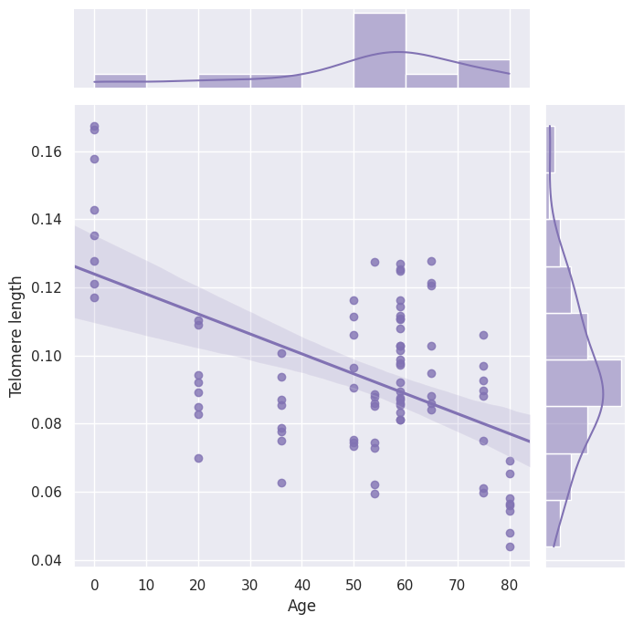

# Welcome to DouLabRotation_2023 documentation!

{ align=right width=300 }

The repository was used to contain tutorials of telemere length calculation for single cell DNA-seq data. It represents the work I completed during the first rotation at the [School of Life Sciences](https://sls.westlake.edu.cn/), [WestLake University](https://www.westlake.edu.cn/) and supervised by Professor [Yanmei Dou](https://www.westlake.edu.cn/faculty/yanmei-dou.html).

To get started with this tutorials, check out the [Tutorials](Tutorials).

For more details about the tutorials, please feel free to contact me.

## Contact

- Lei Hu ([1157269262@qq.com](mailto:1157269262@qq.com), or [hulei@westlake.edu.cn](mailto:hulei@westlake.edu.cn))

